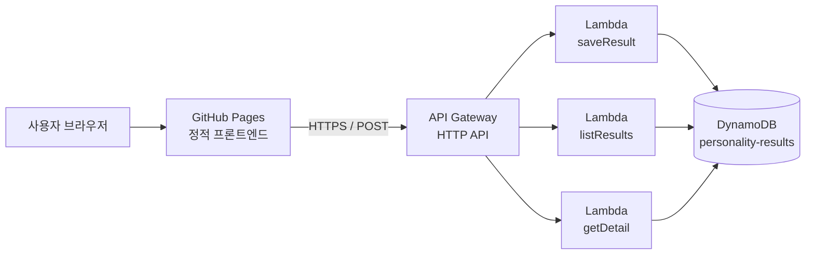

# 인성검사 시뮬레이터

> 대기업 인성검사를 실전처럼 연습하기 위해 만든 웹앱입니다.

주소: https://sunghoooo.github.io/personality-test-sim

## 소개

인성검사는 비슷한 내용을 여러 방식으로 묻기 때문에, 답변이 서로 어긋나면 신뢰도가 낮게 나올 수 있습니다.
이 시뮬레이터는 실제 검사와 비슷한 형식으로 문항을 풀어 보고, **내 응답이 어디서 일관되지 않았는지**를 확인할 수 있게 해 줍니다.

- HEXACO 6요인 구조를 기반으로 자체 제작한 문항
- 풀(455문항) / 하프(224문항) / 쿼터(153문항) 사이즈 중 선택해 응시
- 응답 결과를 저장하고, 이전 기록과 비교해 볼 수 있음

## 아키텍처



| 구분 | 사용 기술 |
| --- | --- |
| 프론트엔드 | HTML, CSS, JavaScript (GitHub Pages 배포) |
| API | Amazon API Gateway (HTTP API) |
| 서버 로직 | AWS Lambda × 3 |
| 데이터베이스 | Amazon DynamoDB (온디맨드) |
| 권한 관리 | AWS IAM |

## 서버리스 구조

처음에는 GitHub Pages만으로 운영했는데, 정적 호스팅이라 **검사 결과를 저장할 방법이 없었습니다.**
브라우저의 localStorage는 기기나 캐시가 바뀌면 기록이 사라지기 때문에, 서버 쪽 저장소가 필요했습니다.

선택지를 비교한 결과는 다음과 같습니다.

| 선택지 | 판단 |
| --- | --- |
| EC2 상시 운영 | 소규모 사용량에 비해 비용과 운영 부담이 큼 |
| RDS + Lambda | Lambda와 커넥션 풀 관리가 맞지 않고, VPC·NAT 구성 비용이 추가로 발생 |
| **API Gateway + Lambda + DynamoDB** | 기존 사이트는 그대로 두고 API 3개만 붙이면 되는 구조. 사용한 만큼만 과금 |

API Gateway가 HTTPS를 기본으로 제공하기 때문에 도메인, 인증서, 로드밸런서를 따로 설정할 필요도 없었습니다.
현재 프리티어 범위 안에서 **운영 비용 0원**으로 유지하고 있습니다.

## API

모든 요청은 `POST` + JSON 본문으로 주고받습니다.

| 경로 | Lambda | 기능 |
| --- | --- | --- |
| `/results` | `personality-saveResult` | 닉네임 + PIN으로 검사 결과 저장 |
| `/results/list` | `personality-listResults` | 내 검사 기록 목록 조회 |
| `/results/detail` | `personality-getDetail` | 특정 검사 결과 상세 조회 |

로그인 없이 쓸 수 있도록 **닉네임 + PIN** 조합으로 사용자를 구분합니다.

## 데이터 설계 (DynamoDB)

테이블 하나(`personality-results`)에 사용자 프로필과 검사 기록을 함께 저장하는 **단일 테이블 설계**를 사용했습니다.

- 파티션 키(`pk`)와 정렬 키(`sk`)로 사용자별 데이터를 묶고, 그 안에서 프로필과 개별 검사 기록을 구분
- 한 사용자의 기록 목록은 `Query` 한 번으로 조회
- 사용량이 일정하지 않은 서비스라 용량을 미리 정하지 않는 **온디맨드 모드** 선택

## 보안 설정

- **IAM 최소 권한 원칙**: FullAccess 정책을 쓰지 않고, `GetItem` / `PutItem` / `Query` 세 가지 동작만 해당 테이블 ARN에 한정해 허용하는 커스텀 정책을 Lambda에 연결
- **CORS 제한**: GitHub Pages 도메인에서 온 요청만 허용하고, `POST` 메서드와 `Content-Type` 헤더만 열어 둠
- PIN은 평문으로 저장하지 않음

## 프론트엔드 구조 (AI로 제작)

```
index.html
js/
├── items.js    문항 데이터
├── engine.js   문항 구성과 채점 (화면과 무관한 순수 계산 로직)
├── ui.js       화면 렌더링
└── api.js      백엔드 API 호출
```

채점 로직(`engine.js`)과 문항 데이터(`items.js`)를 화면 코드와 처음부터 분리해 두었기 때문에,
백엔드를 붙일 때 이 두 파일은 수정하지 않고 `api.js` 추가와 `ui.js` 연동만으로 저장 기능을 넣을 수 있었습니다.
